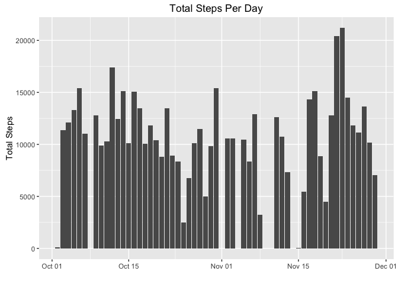
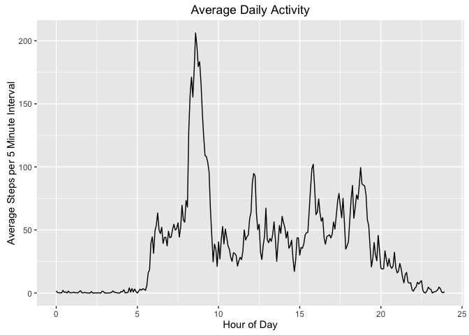
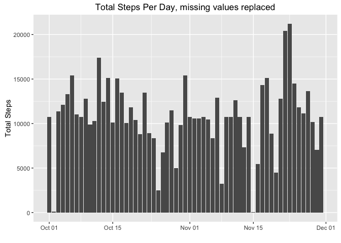
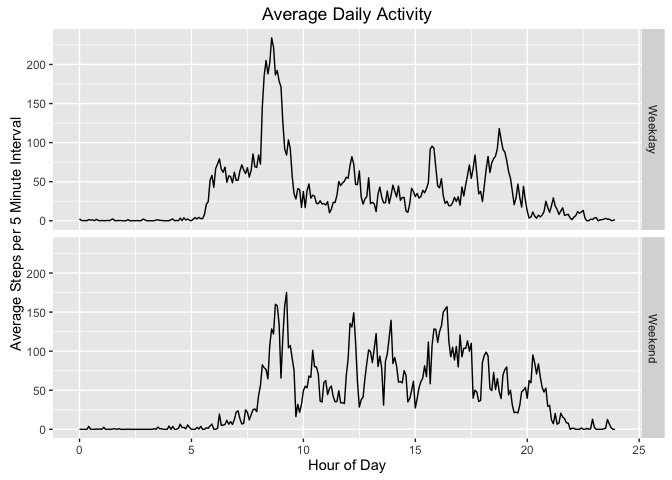

# Reproducible Research: Peer Assessment 1

## Loading and preprocessing the data


```r
unzip("activity.zip")
activity <- read.csv("activity.csv")
activity$ddate <- as.Date(activity$date,format='%Y-%m-%d')
hour <- floor(activity$interval/100)
minute <- activity$interval - hour*100
activity$dechour <- hour + minute/60

# Install plotting package
install.packages("ggplot2", repos="http://cran.us.r-project.org")
library(ggplot2)

# Set global display options
options(scipen = 10, digits = 2)
```

## What is mean total number of steps taken per day?


```r
# Calculate total steps per day
StepsPerDay <- aggregate(steps ~ ddate, data = activity, FUN=sum, na.rm=TRUE)

# Histogram of total steps per day
ggplot(StepsPerDay, aes(x = ddate, y = steps)) + 
    geom_bar(stat = "identity") +
    labs(title="Total Steps Per Day",x="",y="Total Steps")
```



```r
# Mean and median of total steps per day
meansteps <- mean(StepsPerDay$steps, na.rm=TRUE)
mediansteps <- median(StepsPerDay$steps, na.rm=TRUE)
```
The mean total number of steps per day is 10766.19, 
the median total number of steps per day is 10765.

## What is the average daily activity pattern?


```r
# Calculate average steps per 5 minute interval
StepsPerInterval <- aggregate(steps ~ dechour+interval, 
                              data = activity, FUN=mean, na.rm=TRUE)

# Line plot of average steps per interval
ggplot(StepsPerInterval, aes(x = dechour, y = steps)) +
    geom_line() +
    labs(title="Average Daily Activity",x="Hour of Day",
         y="Average Steps per 5 Minute Interval")
```



```r
# Find 5 minute interval with maximum average steps
maxhour <- StepsPerInterval$dechour[which.max(StepsPerInterval$steps)]
maxint <- StepsPerInterval$interval[which.max(StepsPerInterval$steps)]
```
The 5-minute interval with the maximum average number of steps is 835, 
which is hour 8.58.

## Imputing missing values


```r
# Calculate number is missing steps values
numNA <- sum(is.na(activity$steps))
```
Total number of missing steps values is 2304.


```r
# Generate new dataframe, where missing steps values are replaced with the 
# mean for the respective 5 minute interval
activityNew <- activity
activityNew$steps[is.na(activityNew$steps)] <- 
    StepsPerInterval$step[match(activityNew$interval[is.na(activityNew$steps)], 
                                StepsPerInterval$interval)]

# Calculate total steps per day using new dataframe
StepsPerDayNew <- aggregate(steps ~ ddate, data = activityNew, 
                            FUN=sum, na.rm=TRUE)

# Histogram of total steps per day using new dataframe
ggplot(StepsPerDayNew, aes(x = ddate, y = steps)) + 
    geom_bar(stat = "identity") +
    labs(title="Total Steps Per Day, missing values replaced",
         x="",y="Total Steps")
```



```r
# Mean and median of total steps per day using new dataframe
meanstepsNew <- mean(StepsPerDayNew$steps, na.rm=TRUE)
medianstepsNew <- median(StepsPerDayNew$steps, na.rm=TRUE)
```
Using the new dataset, where missing step data is replaced by the average for 
the respective 5 minute interval, the mean total number of steps per day is 
10766.19, the median total number of steps per day is 
10766.19.  Compared to the original dataset, the mean has changed 
by 0 and the median has changed by 
1.19.

## Are there differences in activity patterns between weekdays and weekends?


```r
# Create new factor variable with "weekday" and "weekend"
activity$weekday <- weekdays(activity$ddate)
activity$weekdayend <- factor( 
    ifelse(activity$weekday %in%  c('Saturday','Sunday'), 
           'Weekend', 'Weekday'))

# Calculate average steps per 5 minute interval, grouped by weekend and weekday
StepsPerInterval2 <- aggregate(steps ~ dechour+interval+weekdayend, 
                               data = activity, FUN=mean, na.rm=TRUE)

# Line plot of average steps per interval, grouped by weekend and weekday
ggplot(StepsPerInterval2, aes(x = dechour, y = steps)) +
    geom_line() +
    facet_grid(weekdayend ~ .) +
    labs(title="Average Daily Activity",x="Hour of Day",
         y="Average Steps per 5 Minute Interval")
```



